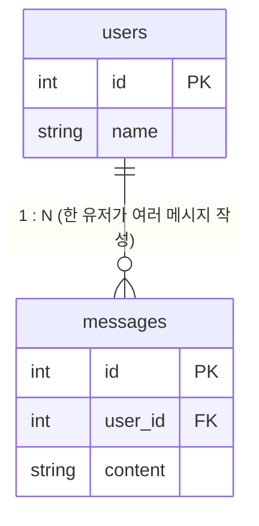
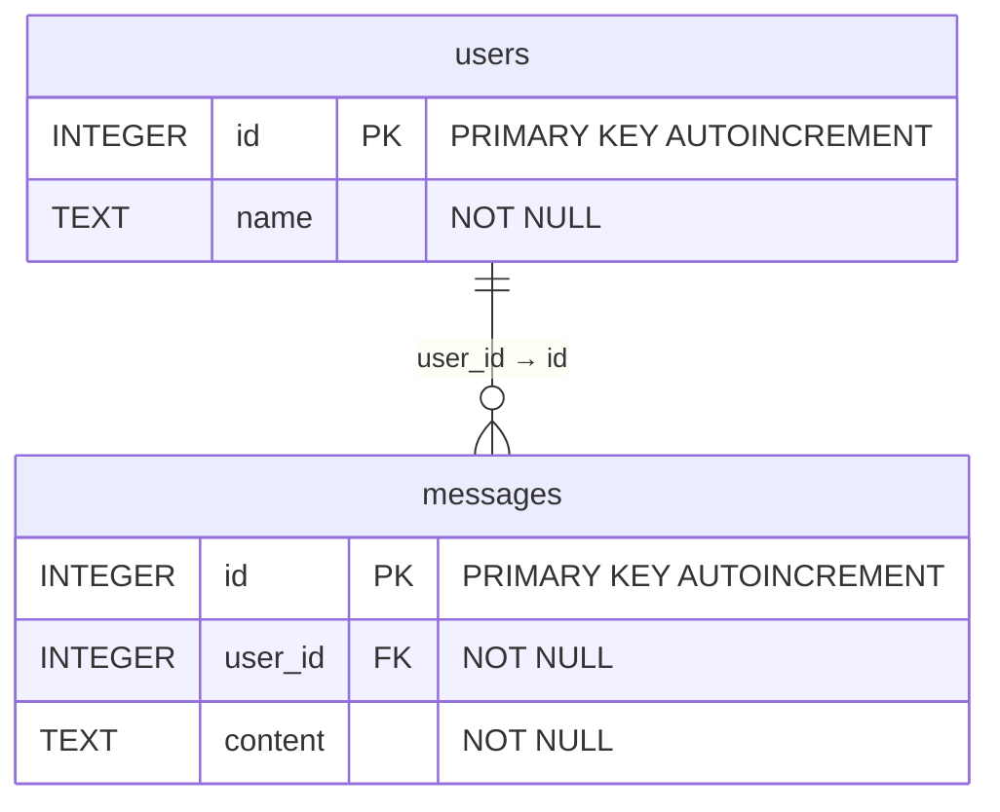

## 🤔 우리 서비스에는 어떤 데이터들이 필요할까요?

<aside> 📌

**개념**

서비스를 만들 때 가장 먼저 던지는 질문 중 하나: **"어떤 데이터를 저장해야 하나?"**

이 과정을 **도메인 설계**라고 합니다. 도메인 = 서비스가 다루는 핵심 개념(명사)들.

</aside>

### 도메인이란?

**도메인(Domain)**은 우리 서비스가 다루는 정보의 카테고리입니다. 쉽게 말하면 "이 서비스에 등장하는 것들"을 명사로 나열한 목록입니다.

- 예를 들어 쇼핑몰 서비스를 만든다면:
    
    - **상품(Product)**: 이름, 가격, 재고 수량
    - **주문(Order)**: 누가, 무엇을, 언제 샀는지
    - **회원(User)**: 이름, 이메일, 배송지 주소
    
    유튜브 같은 영상 플랫폼이라면:
    
    - **영상(Video)**: 제목, 설명, 업로드 날짜
    - **채널(Channel)**: 채널명, 구독자 수
    - **댓글(Comment)**: 내용, 작성자, 작성 시각
    
    이처럼 **"서비스에 존재하는 것들을 명사로 뽑아내는 과정"**이 도메인 설계입니다. 이걸 잘해야 나중에 DB 구조가 깔끔해지고, API 설계도 자연스러워집니다.
    

오늘은 챗봇 서비스를 가정하고 아래 두 도메인을 다룹니다:

- **사용자 (User)**: 누가 챗봇을 사용하는지
- **채팅 메시지 (Message)**: 사용자가 뭘 보냈는지

---

## 🗄️ DB 테이블로 만들기 — CREATE TABLE 문법

도메인을 정했다면 이제 DB에 실제로 **테이블**을 만들고 어떤 구조로 저장할지 정해야 합니다. SQL에서는 `CREATE TABLE` 구문을 사용합니다.

### 기본 문법

```sql
CREATE TABLE 테이블이름 (
    컬럼명  자료형  제약조건,
    컬럼명  자료형  제약조건
);
```

참고로 오늘은 Python에 **기본으로 내장된** `sqlite3`를 사용합니다. 별도 설치 없이 바로 사용 가능해요.

<aside> 💡

**왜 SQLite인가요?**

**별도의 서버 실행 없이 응용 프로그램 내부에 포함되어 동작하는 파일 기반의 경량 관계형 데이터베이스(RDBMS)**입니다. 데이터베이스 전체가 단 하나의 파일(`.db` 또는 `.sqlite`)로 저장되며, 가볍고 관리가 간편해 모바일 앱, IoT 기기, 로컬 데스크톱 프로그램에 주로 사용됩니다.

**서버 설치 없이 로컬에서 바로 테스트할 수 있어요.**

MySQL로 바꾸려면 나중에 연결 설정 부분만 수정하면 됩니다 — 코드 구조는 동일합니다.

</aside>

### 자료형 유형 예시(SQLite)

|자료형|의미|예시|
|---|---|---|
|INTEGER|정수|나이, id, 수량|
|TEXT|문자열|이름, 내용, 이메일|
|REAL|실수|가격, 점수|
|BLOB|이진 데이터|이미지, 파일|

### 제약조건 예시(SQLite)

|제약조건|의미|
|---|---|
|PRIMARY KEY|테이블에서 각 행을 유일하게 식별하는 기본키|
|AUTOINCREMENT|새 행이 추가될 때마다 1씩 자동 증가 (1, 2, 3...)|
|NOT NULL|빈 값(NULL) 허용 안 함 — 반드시 값이 있어야 함|
|FOREIGN KEY|다른 테이블의 컬럼을 참조 — 두 테이블을 연결하는 고리|

- **MySQL 기준**
    
    💡 **SQLite와 MySQL 자료형 차이**
    
    |SQLite|MySQL|
    |---|---|
    |`INTEGER`|`INT`|
    |`TEXT`|`VARCHAR(n)` 또는 `TEXT`|
    |`REAL`|`FLOAT` 또는 `DECIMAL(n,m)`|
    |날짜를 `TEXT`로 저장|`DATETIME`, `DATE`, `TIMESTAMP` 별도 지원|
    
    ### 자료형 유형 예시
    
    |자료형|의미|예시|
    |---|---|---|
    |`INT`|정수|나이, id, 수량|
    |`VARCHAR(n)`|최대 n글자 문자열|이름(50), 이메일(100)|
    |`TEXT`|길이 제한 없는 문자열|메시지 내용, 게시글 본문|
    |`FLOAT`|실수|점수, 위도/경도|
    |`DATETIME`|날짜+시간|작성일시 (2024-01-01 12:00:00)|
    |`DATE`|날짜만|생년월일 (2000-01-01)|
    |`BOOLEAN`|참/거짓|활성화 여부, 읽음 여부|
    
    - **⚖️ CHAR vs VARCHAR vs TEXT데이터 타입**
        
        |데이터 타입|특성|공간 할당 방식|권장 사용 사례|
        |---|---|---|---|
        |**CHAR**|고정 길이|항상 설정한 크기만큼 공간 차지|주민등록번호, 코드(Code) 등 길이가 항상 같은 데이터|
        |**VARCHAR**|가변 길이|입력된 문자열의 길이 + 1~2바이트|이름, 이메일, 주소 등 길이가 일정하지 않은 데이터|
        |**TEXT**|대용량 데이터|데이터 길이에 제한이 없음|게시글 본문, 로그 등 매우 긴 텍스트 데이터|
        
    
    ### 제약조건 유형 예시
    
    |제약조건|의미|
    |---|---|
    |`PRIMARY KEY`|각 행을 유일하게 식별. 중복 불가, NULL 불가|
    |`AUTO_INCREMENT`|새 행 추가 시 1씩 자동 증가 — **MySQL 문법** (SQLite는 `AUTOINCREMENT`)|
    |`NOT NULL`|빈 값 허용 안 함 — 반드시 값이 있어야 함|
    |`UNIQUE`|중복값 불허 (NULL은 예외적으로 중복 허용)|
    |`DEFAULT 값`|값을 지정하지 않으면 기본값 자동 삽입|
    |`FOREIGN KEY`|다른 테이블의 컬럼 참조 — 두 테이블을 연결하는 고리|
    

### users 테이블 만들기

```sql
-- ✅ MySQL 기준
CREATE TABLE users (
    id   INT         PRIMARY KEY AUTO_INCREMENT,  -- 자동 증가 고유 번호
    name VARCHAR(50) NOT NULL                     -- 최대 50자 이름 (빈 값 불가)
);
```

```sql
-- 참고: SQLite 기준 (실습 환경에서 사용)
CREATE TABLE users (
    id   INTEGER PRIMARY KEY AUTOINCREMENT,  -- 자동 증가하는 고유 번호
    name TEXT    NOT NULL                    -- 이름 (빈 값 불가)
);
```

이 SQL을 실행하면 아래처럼 **빈 테이블**이 만들어집니다:

```
┌────┬──────┐
│ id │ name │
├────┼──────┤
│    │      │  ← 아직 데이터 없음
└────┴──────┘
```

데이터를 `INSERT`로 넣으면:

```
┌────┬──────────┐
│ id │ name     │
├────┼──────────┤
│  1 │ 김철수     │  ← id는 직접 입력 안 해도 DB가 자동으로 채워줌
│  2 │ 이영희     │
│  3 │ 박민준     │
└────┴──────────┘
```

`id`는 직접 지정하지 않아도 **DB가 알아서 1, 2, 3... 채워줍니다.**

### messages 테이블 만들기 — 외래키(FOREIGN KEY)

```sql
CREATE TABLE messages (
    id      INTEGER PRIMARY KEY AUTOINCREMENT,
    user_id INTEGER NOT NULL,                        -- 어떤 사용자가 보낸 메시지인지
    content TEXT    NOT NULL,                        -- 메시지 내용
    FOREIGN KEY (user_id) REFERENCES users(id)       -- users 테이블의 id를 참조
);
```

**PK(기본 키)**는 각 행을 고유하게 식별하는 '주민등록번호' 같은 역할을 하며 테이블당 하나만 존재합니다. 반면 **FK(외래 키)**는 다른 테이블의 PK를 가리키며 테이블 간의 관계를 맺어주는 '연결고리' 역할을 합니다.



`messages.user_id = 1`이면 `users` 테이블에서 `id = 1`인 **김철수**가 보낸 메시지입니다.

![[Pasted image 20260526193537.png]]


---

## 🐍 Pydantic 모델이란?

<aside> 📌

**Pydantic 모델**: API 요청/응답 데이터의 **형태(타입)를 정의**하고 **자동으로 검증**해주는 Python 클래스

</aside>

### 왜 Pydantic을 사용하나요?

FastAPI 엔드포인트가 클라이언트로부터 데이터를 받을 때, 아무 데이터나 그냥 받으면 문제가 생깁니다.

예를 들어 메시지 저장 API라면:

- `user_id`는 **반드시 숫자**여야 하고
- `content`는 **비어있으면 안 됩니다**

Pydantic이 없으면 이 검증을 개발자가 직접 해야 합니다:

```python
# Pydantic 없이 직접 검증 — 번거롭고 실수하기 쉬움
@app.post("/messages")
def create_message(data: dict):
    if "user_id" not in data:
        return {"error": "user_id가 없습니다"}
    if not isinstance(data["user_id"], int):
        return {"error": "user_id는 숫자여야 합니다"}
    if "content" not in data or data["content"].strip() == "":
        return {"error": "content가 없습니다"}
    # 이제야 본 로직 시작...
```

Pydantic을 쓰면 이 검증이 **자동**으로 처리됩니다:

```python
# Pydantic 사용 — 검증 자동, 코드가 훨씬 깔끔
class MessageRequest(BaseModel):
    user_id: int    # 정수가 아니면 자동으로 422 에러 반환
    content: str    # 문자열이 아니거나 아예 안 보내면 422 에러 반환

@app.post("/messages")
def create_message(body: MessageRequest):
    # 여기까지 오면 이미 검증 완료 — 바로 본 로직 작성 가능
    ...
```

타입이 맞지 않으면 FastAPI가 자동으로 **422 Unprocessable Entity** 에러와 함께 어떤 필드가 잘못됐는지 상세히 알려줍니다.

### Pydantic 모델 문법

```python
from pydantic import BaseModel
from typing import Optional

class 모델이름(BaseModel):
    필드명: 타입                    # 필수 필드 (값이 반드시 있어야 함)
    필드명: 타입 = 기본값            # 선택 필드 (기본값 지정)
    필드명: Optional[타입] = None   # 선택 필드 (None 허용)
```

**예시:**

```python
from pydantic import BaseModel

# 메시지 생성 요청 스키마 (클라이언트 → 서버)
class MessageCreate(BaseModel):
    user_id: int           # 필수: 반드시 정수
    content: str           # 필수: 반드시 문자열

# 메시지 응답 스키마 (서버 → 클라이언트)
class MessageResponse(BaseModel):
    id: int                # DB가 생성한 id 포함
    user_id: int
    content: str
```

### 요청 스키마 vs 응답 스키마를 왜 분리하나요?

`id`는 DB가 자동으로 생성하기 때문에 **요청(Create) 스키마에는 넣지 않습니다.** 클라이언트가 `id`를 직접 지정하게 두면 다른 데이터와 충돌하거나 의도적으로 조작될 수 있습니다.

```
클라이언트가 보내는 것 (Create):   user_id, content          ← id 없음
서버가 돌려주는 것   (Response):  id, user_id, content      ← id 포함
```

---

## 🆚 Pydantic 모델 vs DB 테이블 — 비교 정리

<aside> 📌

- **Pydantic 모델**: API에서 주고받는 데이터의 모양 — 메모리에 임시로 존재
- **DB 테이블**: 디스크에 **영구 저장**되는 데이터 구조

서버를 재시작하면 메모리 데이터는 사라지지만, DB 데이터는 남습니다.

</aside>

|구분|Pydantic 모델|DB 테이블|
|---|---|---|
|위치|메모리 (임시)|디스크 (영구)|
|서버 재시작 시|데이터 사라짐|데이터 유지|
|문법|Python class|SQL|
|목적|요청/응답 검증|데이터 저장|
|id 포함 여부|Create엔 없음, Response엔 있음|항상 있음 (AUTOINCREMENT)|

```mermaid
# Pydantic 모델 (API 쪽) — Create 스키마에는 id 없음
class MessageCreate(BaseModel):
    user_id: int
    content: str
```

```sql
-- DB 테이블 (저장 쪽) — id 항상 있음
CREATE TABLE messages (
    id      INTEGER PRIMARY KEY AUTOINCREMENT,
    user_id INTEGER NOT NULL,
    content TEXT    NOT NULL
);
```

구조가 비슷하죠? 다음 섹션에서 이 둘을 코드로 직접 연결합니다.

---

## 🏗️ 실습: 테이블 설계해보기

<aside> 📝

**실습 문제**

챗봇 서비스에 필요한 두 테이블을 직접 설계해보세요.

- `users` 테이블: `id` (자동증가), `name`
- `messages` 테이블: `id` (자동증가), `user_id` (users 참조), `content` </aside>

### 진행 순서

**Step 1. users 테이블 작성**

아래 조건을 보고 SQL을 작성해보세요:

- 테이블 이름: `users`
- `id` 컬럼: 정수 타입, 기본키, 자동 증가
- `name` 컬럼: 문자열 타입, 빈 값 불가

**Step 2. messages 테이블 작성**

- 테이블 이름: `messages`
- `id` 컬럼: 정수, 기본키, 자동 증가
- `user_id` 컬럼: 정수, 빈 값 불가, `users` 테이블의 `id`를 참조 (외래키)
- `content` 컬럼: 문자열, 빈 값 불가



**Step 3. 완성 후 확인**

> Extensions (SQLite Viewer 혹은 SQLite) 설치하고 .db 파일 클릭해보면 데이터 테이블 조회 가능합니다.

```sql
-- users 테이블에 데이터 넣기 (id는 자동 생성되므로 name만 넣습니다)
INSERT INTO users (name) VALUES ('김철수');
INSERT INTO users (name) VALUES ('이영희');

-- messages 테이블에 데이터 넣기
INSERT INTO messages (user_id, content) VALUES (1, '안녕하세요');
INSERT INTO messages (user_id, content) VALUES (1, '날씨가 좋네요');
INSERT INTO messages (user_id, content) VALUES (2, '반갑습니다');
```

```mermaid
# 1. practice 폴더 안으로 이동
cd practice

# 2. 다시 파이썬 파일 실행
python 01_schema.py
```

- **데이터를 넣으면 이렇게 보입니다:**
    
    users 테이블:
    
    ```
    ┌────┬──────────┐
    │ id │ name     │
    ├────┼──────────┤
    │  1 │ 김철수     │
    │  2 │ 이영희     │
    └────┴──────────┘
    ```
    
    
    
    messages 테이블:
    
    ```
    ┌────┬─────────┬─────────────────┐
    │ id │ user_id │ content         │
    ├────┼─────────┼─────────────────┤
    │  1 │    1    │ 안녕하세요         │  ← user_id=1 → 김철수가 보낸 메시지
    │  2 │    1    │ 날씨가 좋네요       │  ← user_id=1 → 김철수가 보낸 메시지
    │  3 │    2    │ 반갑습니다         │  ← user_id=2 → 이영희가 보낸 메시지
    └────┴─────────┴─────────────────┘
    ```
    
    
    
- **문법 힌트**
    
    각 조건을 SQL로 어떻게 표현하는지 대응표입니다:
    
    |조건|SQL 표현|
    |---|---|
    |정수 타입|`INTEGER`|
    |문자열 타입|`TEXT`|
    |기본키 지정|`PRIMARY KEY`|
    |자동 증가|`AUTOINCREMENT`|
    |빈 값 불가|`NOT NULL`|
    |외래키 (다른 테이블 참조)|`FOREIGN KEY (컬럼명) REFERENCES 참조테이블(참조컬럼)`|
    
    기본 구조:
    
    ```sql
    CREATE TABLE 테이블명 (
        컬럼명  자료형  제약조건,
        컬럼명  자료형  제약조건,
        FOREIGN KEY (컬럼명) REFERENCES 다른테이블(컬럼명)
    );
    ```
    
    외래키는 컬럼 정의 맨 마지막 줄에 따로 씁니다.
    
- **정답 예시**
    
    ```sql
    CREATE TABLE users (
        id   INTEGER PRIMARY KEY AUTOINCREMENT,  -- 자동 증가하는 고유 번호
        name TEXT    NOT NULL                    -- 이름 (빈 값 불가)
    );
    
    CREATE TABLE messages (
        id      INTEGER PRIMARY KEY AUTOINCREMENT,
        user_id INTEGER NOT NULL,
        content TEXT    NOT NULL,
        FOREIGN KEY (user_id) REFERENCES users(id)  -- users 테이블의 id를 참조
    );
    ```
    

---

## 🔄 전체 데이터 흐름 미리보기

<aside> 🔄

다음 섹션에서 아래 흐름을 코드로 구현합니다.

**저장**: 클라이언트 → `POST /messages` → FastAPI → DB INSERT → 응답

**조회**: 클라이언트 → `GET /messages` → FastAPI → DB SELECT → 응답

**삭제**: 클라이언트 → `DELETE /messages/{id}` → FastAPI → DB DELETE → 응답

</aside>